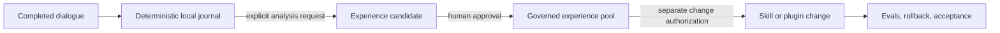

# Lorekiln — Local-First Memory for Codex Agents

> **Keep the record. Earn the lesson. Control the change.**

Lorekiln is an open-source **persistent AI agent memory plugin for Codex**. It combines local conversation journaling, on-demand experience distillation, a governed long-term experience store, and human-authorized Skill or plugin evolution—without automatically injecting an entire chat history into every prompt.

If you are looking for **Codex memory**, **local AI agent memory**, **persistent conversation memory**, **token-efficient context management**, **auditable agent learning**, or **human-in-the-loop agent improvement**, Lorekiln is built for that problem.

## The problem it solves

Useful lessons disappear across sessions, but conventional agent memory often creates a second problem: more retrieved context, unclear provenance, and behavior changes nobody explicitly approved.

Lorekiln separates four jobs that should not be conflated:



The result is persistent memory with an inspectable chain from raw conversation evidence to any later capability change.

## Capabilities at a glance

| Capability | What Lorekiln does | Why it matters |
|---|---|---|
| Local conversation memory | Journals completed Codex turns with deterministic scripts and SQLite. | Preserves source evidence without an LLM call or external memory service. |
| Manual memory checkpoints | Creates explicit anchors over completed dialogue ranges. | Lets users freeze a trustworthy analysis boundary before a session ends. |
| Experience distillation | Analyzes only selected anchors when the user asks. | Avoids spending tokens on automatic interpretation of every turn. |
| Long-term experience memory | Organizes approved lessons by domain, evidence, scope, relations, and freshness. | Makes reusable knowledge queryable across sessions without treating every chat as truth. |
| Human-governed agent learning | Separates experience approval from authorization to edit a Skill, plugin, or workflow. | Prevents silent self-modification. |
| Verifiable capability evolution | Uses baselines, Evals, regression tests, rollback material, and final acceptance. | Makes agent improvement reviewable and reversible. |
| Crash recovery | Repairs completed dialogue missed before an abnormal exit. | Reduces memory gaps without relying only on `SessionEnd`. |

## Lorekiln compared with common memory approaches

| Approach | Typical behavior | Lorekiln difference |
|---|---|---|
| Chat history | Stores past messages for later reading. | Adds deterministic checkpoints, evidence provenance, experience governance, and controlled application. |
| RAG or vector memory | Retrieves semantically similar fragments into the prompt. | Does not automatically inject the experience pool; retrieval is explicit and progressive. |
| Automatic summarization | Uses a model to continuously compress conversation. | Mechanical capture is model-free; semantic analysis runs only on request. |
| Agent self-improvement loop | Lets observations automatically rewrite prompts or tools. | Experience approval and capability-change authorization are separate human decisions. |
| Cloud memory service | Sends memory to an external store or API. | Runtime journals and experience databases remain local to the Codex plugin environment. |

Lorekiln can complement RAG; it is not a vector database. Its focus is **governed experiential memory and traceable capability evolution**.

## Who it is for

- Codex users who need memory across sessions without loading all history into every context window;
- AI agent, Skill, and plugin developers who need provenance, review states, and rollback;
- privacy-conscious users who want local-first conversation storage;
- teams experimenting with agent learning but unwilling to allow silent behavior changes.

## What it deliberately does not do

- It does not automatically inject all stored memories into every prompt.
- It does not treat every conversation as a reusable lesson.
- It does not modify Skills or plugins merely because an experience was approved.
- It does not upload dialogue journals or local runtime databases to this repository.
- It does not claim compatibility with every agent platform; the current public release targets Codex.

## Install the Codex plugin

Prerequisites: Codex, Git, and Python 3.11 or newer.

```bash
git clone https://github.com/popover1917/lorekiln.git
cd lorekiln
codex plugin marketplace add .
codex plugin add lorekiln@lorekiln
```

Start a new Codex task after installation so its Skills and lifecycle hooks are loaded. Verify the runtime:

```bash
python plugins/lorekiln/scripts/memory_runtime.py doctor
python plugins/lorekiln/scripts/memory_runtime.py status
```

`doctor` must report `healthy: true`. Seeing a cached Skill alone does not prove that lifecycle hooks are trusted and running.

## Example prompts

Create a deterministic memory checkpoint without analysis:

```text
Save all completed conversation through this point as a memory anchor.
```

Distill reusable experience without modifying behavior:

```text
Distill reusable lessons from anchor <anchor-id>, but do not modify any capability.
```

Review long-term agent memory in one domain:

```text
Review pending experience candidates in the software-development domain.
```

Start a governed capability-change proposal:

```text
Propose an evidence-backed change to <named-skill> from approved experience <experience-id>.
```

The last request begins a change proposal. Editing still requires target-specific authorization, and adoption still requires final user acceptance.

## Architecture and lifecycle

| Codex event | Lorekiln behavior |
|---|---|
| `Stop` | Primary incremental write for each completed turn. |
| `SessionEnd` | Best-effort close marker, not the sole persistence mechanism. |
| `SessionStart` | Repairs completed dialogue missed before an abnormal exit. |
| `UserPromptSubmit` | Detects a manual-anchor request and freezes the boundary before the control prompt. |

Repository layout:

```text
.agents/plugins/marketplace.json   Codex marketplace catalog
.github/workflows/quality.yml      Public CI and privacy checks
plugins/lorekiln/                  Installable plugin
tests/                             Isolated public smoke tests
```

See the [plugin reference](plugins/lorekiln/README.md) for components, lifecycle boundaries, and local verification commands.

## Privacy and token use

Mechanical journaling runs through local scripts rather than an LLM, so capture itself does not add model-token usage. Token cost appears only when the user explicitly requests semantic analysis or discussion. Runtime journals, SQLite databases, trust state, and generated experience records remain in the local Codex plugin data directory.

Never commit generated memory data or attach private transcripts to a public issue. See [SECURITY.md](SECURITY.md).

## Frequently asked questions

### Is Lorekiln a long-term memory plugin for Codex?

Yes. It persists completed dialogue and approved experience across sessions. Unlike automatic recall systems, it keeps capture, interpretation, approval, retrieval, and capability changes as separate stages.

### Does Lorekiln reduce token usage?

Its mechanical capture layer uses scripts, not model calls, and it does not automatically inject the whole memory store. Actual savings depend on how often and how broadly the user requests analysis or retrieval.

### Is Lorekiln an automatic self-improvement system?

No. It can support evidence-backed Skill or plugin evolution, but only after explicit analysis, experience approval, a separate change report, target-specific authorization, tests, and final acceptance.

### Is conversation data uploaded anywhere?

Not by Lorekiln's runtime. Journals and experience databases are stored locally. Normal GitHub access is needed only to download or contribute source code.

### Is Lorekiln a RAG framework or vector database?

No. It focuses on durable evidence, governed experience, and controlled application. It can coexist with RAG or vector retrieval systems.

## Project status

`v0.2.0` is an early-access release for Codex. The separation between capture, analysis, experience governance, and authorized evolution is implemented. Broader platform compatibility and larger public eval suites remain active work.

Contributions should include reproducible evidence, tests for behavior changes, and privacy impact. See [CONTRIBUTING.md](CONTRIBUTING.md) and the [v0.2.0 release](https://github.com/popover1917/lorekiln/releases/tag/v0.2.0).

## Search concepts

Lorekiln belongs to the following product categories: **AI agent memory**, **Codex plugin**, **persistent memory**, **conversation journaling**, **long-term experience memory**, **local-first AI**, **token-efficient memory**, **auditable agent learning**, **human-in-the-loop AI**, and **controlled agent self-improvement**.

## License

MIT. See [LICENSE](LICENSE).
