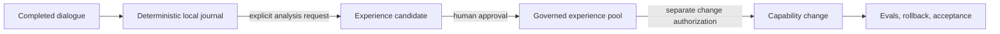

# Lorekiln

> **Keep the record. Earn the lesson. Control the change.**

Lorekiln is a local-first, human-governed memory and capability-evolution plugin for Codex. It preserves completed dialogue without model calls, turns selected evidence into reviewable experience only on request, and keeps behavior changes behind a separate authorization, test, and acceptance path.

## Why Lorekiln

Agent memory often collapses three different jobs into one: recording what happened, deciding what it means, and changing future behavior. Lorekiln separates them so that useful learning does not require silent context injection or invisible self-modification.



## Built for

- Codex power users who want durable project learning without sending conversation history to another service;
- agent and Skill authors who need evidence, provenance, review states, and rollback;
- teams that want memory capture to remain cheap and mechanical while interpretation remains deliberate.

## What makes it different

| Principle | Lorekiln behavior |
|---|---|
| Faithful capture | Completed turns are journaled locally by deterministic scripts, without an LLM call. |
| Deliberate interpretation | Distillation starts only when the user explicitly requests analysis. |
| Governed memory | Candidates can be approved, narrowed, rejected, retired, or superseded. |
| Controlled evolution | Approved experience cannot silently modify a Skill, plugin, or workflow. |
| Verifiable change | Capability edits use a frozen baseline, evals, regression checks, rollback material, and final acceptance. |

## What it does not do

- It does not automatically inject all stored memories into every prompt.
- It does not treat every conversation as a reusable lesson.
- It does not modify Skills or plugins merely because an experience was approved.
- It does not upload dialogue journals or local runtime databases to this repository.

## Install

Prerequisites: Codex, Git, and Python 3.11 or newer.

```bash
git clone https://github.com/popover1917/lorekiln.git
cd lorekiln
codex plugin marketplace add .
codex plugin add lorekiln@lorekiln
```

Start a new Codex task after installation so its Skills and lifecycle hooks are loaded. Then verify the runtime:

```bash
python plugins/lorekiln/scripts/memory_runtime.py doctor
python plugins/lorekiln/scripts/memory_runtime.py status
```

`doctor` must report `healthy: true`; seeing a cached Skill alone does not prove that hooks are trusted and running.

## Use the gates explicitly

```text
Save all completed conversation through this point as a memory anchor.
```

```text
Distill reusable lessons from anchor <anchor-id>, but do not modify any capability.
```

```text
Review pending experience candidates in the software-development domain.
```

```text
Propose an evidence-backed change to <named-skill> from approved experience <experience-id>.
```

The last request starts a governed engineering workflow; it does not erase the separate authorization and acceptance gates.

## Repository layout

```text
.agents/plugins/marketplace.json   Codex marketplace catalog
.github/workflows/quality.yml      Public CI and privacy checks
plugins/lorekiln/                  Installable plugin
tests/                             Isolated public smoke tests
```

The detailed component and lifecycle reference lives in the [plugin guide](plugins/lorekiln/README.md).

## Privacy and security

Runtime journals, SQLite databases, trust state, and generated experience records stay in the local Codex plugin data directory. Never commit them or attach private transcripts to a public issue. See [SECURITY.md](SECURITY.md) for reporting guidance.

## Status

`v0.2.0` is an early-access public release. The capture/analysis/governance/evolution separation is implemented; broader platform testing and larger public eval suites remain active work.

Contributions are welcome through focused, reproducible issues and pull requests. See [CONTRIBUTING.md](CONTRIBUTING.md).

## License

MIT. See [LICENSE](LICENSE).
