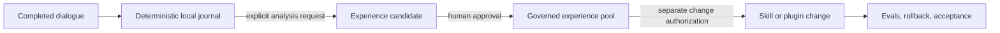
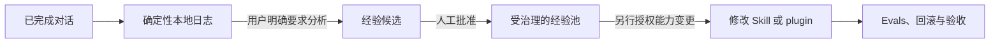

# Lorekiln — Local-First Memory for Codex Agents

> **Keep the record. Earn the lesson. Control the change.**

Lorekiln is an open-source **persistent AI agent memory plugin for Codex**. It combines local conversation journaling, on-demand experience distillation, a governed long-term experience store, and human-authorized Skill or plugin evolution—without automatically injecting an entire chat history into every prompt.

Canonical repository: [GitHub](https://github.com/popover1917/lorekiln). Manually synchronized public backup: [Gitee](https://gitee.com/wenjie-the-whisper-of-wisdom/lorekiln). GitHub remains the source of truth; the Gitee mirror is updated only when the owner explicitly requests synchronization.

If you are looking for **Codex memory**, **local AI agent memory**, **persistent conversation memory**, **token-efficient context management**, **auditable agent learning**, or **human-in-the-loop agent improvement**, Lorekiln is built for that problem.

## The problem it solves

Useful lessons disappear across sessions, but conventional agent memory often creates a second problem: more retrieved context, unclear provenance, and behavior changes nobody explicitly approved.

Lorekiln separates four jobs that should not be conflated:



The result is persistent memory with an inspectable chain from raw conversation evidence to any later capability change.

## Capabilities at a glance

| Capability | What Lorekiln does | Why it matters |
|---|---|---|
| Local conversation memory | Journals completed Codex turns with deterministic scripts and SQLite. | Preserves source evidence without an LLM call or external memory service. |
| Manual memory checkpoints | Creates explicit anchors over completed dialogue ranges. | Lets users freeze a trustworthy analysis boundary before a session ends. |
| Experience distillation | Analyzes only selected anchors when the user asks. | Avoids spending tokens on automatic interpretation of every turn. |
| Long-term experience memory | Organizes approved lessons by domain, evidence, scope, relations, and freshness. | Makes reusable knowledge queryable across sessions without treating every chat as truth. |
| Human-governed agent learning | Separates experience approval from authorization to edit a Skill, plugin, or workflow. | Prevents silent self-modification. |
| Verifiable capability evolution | Uses baselines, Evals, regression tests, rollback material, and final acceptance. | Makes agent improvement reviewable and reversible. |
| Crash recovery | Repairs completed dialogue missed before an abnormal exit. | Reduces memory gaps without relying only on `SessionEnd`. |

## Lorekiln compared with common memory approaches

| Approach | Typical behavior | Lorekiln difference |
|---|---|---|
| Chat history | Stores past messages for later reading. | Adds deterministic checkpoints, evidence provenance, experience governance, and controlled application. |
| RAG or vector memory | Retrieves semantically similar fragments into the prompt. | Does not automatically inject the experience pool; retrieval is explicit and progressive. |
| Automatic summarization | Uses a model to continuously compress conversation. | Mechanical capture is model-free; semantic analysis runs only on request. |
| Agent self-improvement loop | Lets observations automatically rewrite prompts or tools. | Experience approval and capability-change authorization are separate human decisions. |
| Cloud memory service | Sends memory to an external store or API. | Runtime journals and experience databases remain local to the Codex plugin environment. |

Lorekiln can complement RAG; it is not a vector database. Its focus is **governed experiential memory and traceable capability evolution**.

## Who it is for

- Codex users who need memory across sessions without loading all history into every context window;
- AI agent, Skill, and plugin developers who need provenance, review states, and rollback;
- privacy-conscious users who want local-first conversation storage;
- teams experimenting with agent learning but unwilling to allow silent behavior changes.

## What it deliberately does not do

- It does not automatically inject all stored memories into every prompt.
- It does not treat every conversation as a reusable lesson.
- It does not modify Skills or plugins merely because an experience was approved.
- It does not upload dialogue journals or local runtime databases to this repository.
- It does not claim compatibility with every agent platform; the current public release targets Codex.

## Install the Codex plugin

Prerequisites: Codex, Git, and Python 3.11 or newer.

```bash
git clone https://github.com/popover1917/lorekiln.git
cd lorekiln
codex plugin marketplace add .
codex plugin add lorekiln@lorekiln
```

Start a new Codex task after installation so its Skills and lifecycle hooks are loaded. Verify the runtime:

```bash
python plugins/lorekiln/scripts/memory_runtime.py doctor
python plugins/lorekiln/scripts/memory_runtime.py status
```

`doctor` must report `healthy: true`. Seeing a cached Skill alone does not prove that lifecycle hooks are trusted and running.

## Example prompts

Create a deterministic memory checkpoint without analysis:

```text
Save all completed conversation through this point as a memory anchor.
```

Distill reusable experience without modifying behavior:

```text
Distill reusable lessons from anchor <anchor-id>, but do not modify any capability.
```

Review long-term agent memory in one domain:

```text
Review pending experience candidates in the software-development domain.
```

Start a governed capability-change proposal:

```text
Propose an evidence-backed change to <named-skill> from approved experience <experience-id>.
```

The last request begins a change proposal. Editing still requires target-specific authorization, and adoption still requires final user acceptance.

## Architecture and lifecycle

| Codex event | Lorekiln behavior |
|---|---|
| `Stop` | Primary incremental write for each completed turn. |
| `SessionEnd` | Best-effort close marker, not the sole persistence mechanism. |
| `SessionStart` | Repairs completed dialogue missed before an abnormal exit. |
| `UserPromptSubmit` | Detects a manual-anchor request and freezes the boundary before the control prompt. |

Repository layout:

```text
.agents/plugins/marketplace.json   Codex marketplace catalog
.github/workflows/quality.yml      Public CI and privacy checks
plugins/lorekiln/                  Installable plugin
tests/                             Isolated public smoke tests
```

See the [plugin reference](plugins/lorekiln/README.md) for components, lifecycle boundaries, and local verification commands.

## Privacy and token use

Mechanical journaling runs through local scripts rather than an LLM, so capture itself does not add model-token usage. Token cost appears only when the user explicitly requests semantic analysis or discussion. Runtime journals, SQLite databases, trust state, and generated experience records remain in the local Codex plugin data directory.

Never commit generated memory data or attach private transcripts to a public issue. See [SECURITY.md](SECURITY.md).

## Frequently asked questions

### Is Lorekiln a long-term memory plugin for Codex?

Yes. It persists completed dialogue and approved experience across sessions. Unlike automatic recall systems, it keeps capture, interpretation, approval, retrieval, and capability changes as separate stages.

### Does Lorekiln reduce token usage?

Its mechanical capture layer uses scripts, not model calls, and it does not automatically inject the whole memory store. Actual savings depend on how often and how broadly the user requests analysis or retrieval.

### Is Lorekiln an automatic self-improvement system?

No. It can support evidence-backed Skill or plugin evolution, but only after explicit analysis, experience approval, a separate change report, target-specific authorization, tests, and final acceptance.

### Is conversation data uploaded anywhere?

Not by Lorekiln's runtime. Journals and experience databases are stored locally. Normal GitHub access is needed only to download or contribute source code.

### Is Lorekiln a RAG framework or vector database?

No. It focuses on durable evidence, governed experience, and controlled application. It can coexist with RAG or vector retrieval systems.

## Project status

`v0.2.0` is an early-access release for Codex. The separation between capture, analysis, experience governance, and authorized evolution is implemented. Broader platform compatibility and larger public eval suites remain active work.

Contributions should include reproducible evidence, tests for behavior changes, and privacy impact. See [CONTRIBUTING.md](CONTRIBUTING.md) and the [v0.2.0 release](https://github.com/popover1917/lorekiln/releases/tag/v0.2.0).

## Search concepts

Lorekiln belongs to the following product categories: **AI agent memory**, **Codex plugin**, **persistent memory**, **conversation journaling**, **long-term experience memory**, **local-first AI**, **token-efficient memory**, **auditable agent learning**, **human-in-the-loop AI**, and **controlled agent self-improvement**.

## License

MIT. See [LICENSE](LICENSE).

---

# Lorekiln — 面向 Codex Agent 的本地优先记忆

> **保存记录。提炼经验。掌控变更。**

Lorekiln 是一款面向 Codex 的开源**持久化 AI Agent 记忆 plugin**。它将本地对话日志、按需经验萃取、受治理的长期经验池，以及经人类授权的 Skill 或 plugin 演进组合在一起，同时避免把全部对话历史自动注入每一次 prompt。

主仓库：[GitHub](https://github.com/popover1917/lorekiln)。手动同步的公开备份：[Gitee](https://gitee.com/wenjie-the-whisper-of-wisdom/lorekiln)。GitHub 始终是唯一事实源；只有所有者明确要求同步时，才更新 Gitee 镜像。

如果你正在寻找 **Codex memory**、**本地 AI Agent 记忆**、**持久化对话记忆**、**节省 Token 的上下文管理**、**可审计的 Agent 学习**或**人类参与治理的 Agent 改进**，Lorekiln 正是为此而设计。

## 它解决什么问题

有价值的经验往往会在不同会话之间消失，但传统 Agent memory 又容易制造另一类问题：召回内容不断膨胀、证据来源不清晰，以及用户未明确批准的行为变化。

Lorekiln 将四类不应混淆的工作明确分离：



最终形成一条可检查的证据链：从原始对话记录，一直追溯到后续的能力变更。

## 核心能力

| 能力 | Lorekiln 的做法 | 价值 |
|---|---|---|
| 本地对话记忆 | 使用确定性脚本和 SQLite 记录已完成的 Codex 回合 | 无需 LLM 调用或外部记忆服务即可保留原始证据 |
| 手动记忆锚点 | 为已完成的对话范围创建显式锚点 | 在会话结束前冻结可信的分析边界 |
| 经验萃取 | 仅在用户要求时分析指定锚点 | 避免自动解释每个回合造成 Token 消耗 |
| 长期经验池 | 按领域、证据、适用范围、关系和时效组织获批经验 | 让经验可以跨会话查询，又不把每次对话都当成真理 |
| 人类治理的 Agent 学习 | 将经验批准与修改 Skill、plugin 或工作流的授权分离 | 防止静默自我修改 |
| 可验证的能力演进 | 使用基线、Evals、回归测试、回滚材料和最终验收 | 让 Agent 改进可审查、可撤销 |
| 异常恢复 | 补齐异常退出前已经完成但尚未保存的对话 | 降低记忆缺口，不把可靠性完全押在 `SessionEnd` 上 |

## 与常见记忆方案的区别

| 方案 | 常见行为 | Lorekiln 的区别 |
|---|---|---|
| Chat history | 保存历史消息，供以后重新读取 | 增加确定性锚点、证据溯源、经验治理和受控应用 |
| RAG 或 vector memory | 将语义相似片段召回 prompt | 不自动注入经验池；召回由用户显式触发，并采用渐进式加载 |
| 自动摘要 | 持续使用模型压缩对话 | 机械记录不调用模型，语义分析仅按需执行 |
| Agent 自我改进循环 | 让观察结果自动重写 prompt 或工具 | 经验批准与能力修改授权是两个独立的人类决策 |
| 云端记忆服务 | 将记忆发送到外部存储或 API | 运行日志和经验数据库保留在本地 Codex plugin 环境 |

Lorekiln 可以与 RAG 配合使用，但它不是 vector database。它关注的是**受治理的经验记忆与可追溯的能力演进**。

## 适用人群

- 需要跨会话记忆、又不希望每次加载全部历史的 Codex 用户；
- 需要证据来源、审核状态和回滚能力的 AI Agent、Skill 与 plugin 开发者；
- 希望对话数据优先保留在本地的隐私敏感用户；
- 希望探索 Agent 学习、但拒绝静默行为变化的团队。

## 它刻意不做什么

- 不把全部记忆自动注入每次 prompt；
- 不把每次对话都视为可复用经验；
- 不因经验获批就自动修改 Skill 或 plugin；
- 不把对话日志或本地运行数据库上传到本仓库；
- 不宣称兼容所有 Agent 平台；当前公开版本面向 Codex。

## 安装 Codex plugin

前置条件：Codex、Git，以及 Python 3.11 或更高版本。

```bash
git clone https://github.com/popover1917/lorekiln.git
cd lorekiln
codex plugin marketplace add .
codex plugin add lorekiln@lorekiln
```

安装后启动新的 Codex 任务，使 Skill 与生命周期 Hook 完成加载。运行：

```bash
python plugins/lorekiln/scripts/memory_runtime.py doctor
python plugins/lorekiln/scripts/memory_runtime.py status
```

`doctor` 必须报告 `healthy: true`。仅看到缓存中的 Skill，并不能证明生命周期 Hook 已被信任并实际运行。

## 示例 prompt

创建确定性记忆锚点，但不进行分析：

```text
请将截止到当前的所有完整对话保存为记忆锚点。
```

萃取经验，但不修改任何能力：

```text
请从锚点 <anchor-id> 中萃取可复用经验，但不要修改任何能力。
```

审核某个领域的长期经验：

```text
请审核 software-development 领域中尚未处理的经验候选。
```

发起受治理的能力变更提案：

```text
请基于已批准经验 <experience-id>，为 <named-skill> 提交一份有证据支持的变更提案。
```

最后一条请求只会进入变更提案阶段。真正编辑仍需要针对目标的明确授权，采用变更仍需要用户最终验收。

## 架构与生命周期

| Codex 事件 | Lorekiln 行为 |
|---|---|
| `Stop` | 每个完整回合的主要增量写入边界 |
| `SessionEnd` | 尽力写入关闭标记，但不是唯一持久化机制 |
| `SessionStart` | 补齐异常退出前遗漏的完整对话 |
| `UserPromptSubmit` | 识别手动锚点请求，并在控制 prompt 前冻结边界 |

仓库结构：

```text
.agents/plugins/marketplace.json   Codex marketplace catalog
.github/workflows/quality.yml      公开 CI 与隐私检查
plugins/lorekiln/                  可安装的 plugin
tests/                             隔离的公开 smoke tests
```

组件、生命周期边界及本地验证命令详见 [plugin reference](plugins/lorekiln/README.md)。

## 隐私与 Token 使用

机械日志由本地脚本完成，而不是调用 LLM，因此记录行为本身不会增加模型 Token。只有用户明确要求语义分析或讨论时才产生模型开销。运行日志、SQLite 数据库、信任状态和生成的经验记录均保存在本地 Codex plugin 数据目录。

不要提交生成的记忆数据，也不要在公开 Issue 中附加私人对话。参见 [SECURITY.md](SECURITY.md)。

## 常见问题

### Lorekiln 是 Codex 的长期记忆 plugin 吗？

是。它可以跨会话保存完整对话和已批准经验。与自动召回系统不同，它将记录、解释、批准、检索和能力修改拆分为独立阶段。

### Lorekiln 能降低 Token 消耗吗？

机械记录层使用脚本而非模型调用，也不会自动注入整个记忆库。实际节省量取决于用户触发分析或检索的频率和范围。

### Lorekiln 是自动自我改进系统吗？

不是。它支持基于证据的 Skill 或 plugin 演进，但必须依次经过显式分析、经验批准、独立变更报告、目标授权、测试和最终验收。

### 对话数据会被上传吗？

Lorekiln 运行时不会上传对话。日志与经验数据库均保存在本地。只有下载或贡献源码时才需要正常访问 GitHub。

### Lorekiln 是 RAG framework 或 vector database 吗？

不是。它关注持久化证据、经验治理和受控应用，可以与 RAG 或 vector retrieval system 共存。

## 项目状态

`v0.2.0` 是面向 Codex 的 early-access release。记录、分析、经验治理和授权演进之间的分离已经实现；更广泛的平台兼容性和更大规模的公开 Evals 仍在持续建设。

贡献应包含可复现证据、针对行为变更的测试以及隐私影响说明。参见 [CONTRIBUTING.md](CONTRIBUTING.md) 和 [v0.2.0 release](https://github.com/popover1917/lorekiln/releases/tag/v0.2.0)。

## 检索概念

Lorekiln 属于以下产品类别：**AI Agent memory**、**Codex plugin**、**persistent memory**、**conversation journaling**、**long-term experience memory**、**local-first AI**、**token-efficient memory**、**auditable agent learning**、**human-in-the-loop AI** 和 **controlled agent self-improvement**。

## License

MIT，参见 [LICENSE](LICENSE)。
